<picture>
  <source media="(prefers-color-scheme: dark)" srcset="./assets/header-dark.svg">
  <source media="(prefers-color-scheme: light)" srcset="./assets/header-light.svg">
  
</picture>

<p align="center">
  <a href="https://srreal.co"></a>
  <a href="https://x.com/larusajs"></a>
  <a href="https://instagram.com/enes.ships"></a>
  <a href="https://www.linkedin.com/in/larusajs/"></a>
  <a href="https://github.com/Srreal-Studio"></a>
</p>

<br>

I'm a 22-year-old Turkish founder running a US company. I started writing code at 17 and opened my first company at 18.
Now I build **AI agents, iOS apps and SaaS**, for clients through **[Srreal Studio](https://srreal.co)** and for myself.

I'm documenting the whole road from **0 → $1M ARR** in public, one day at a time.

```ts
const enes = {
  based:     "Ankara, TR",
  company:   "Srreal Studio LLC — Wyoming, US",
  ships:     ["AI agents", "iOS apps", "SaaS", "Shopify tooling"],
  mission:   "0 → $1M ARR",
  sideQuest: "0 → Ironman 70.3",
  status:    "building in public, every day",
};
```

<br>

## Shipping

| | Product | What it is | Status |
|:-:|:--|:--|:--|
| ◼ | **Locki** | iOS app | `live · App Store` |
| ◼ | **[LovLetter](https://lovletter.co)** | Romantic time-capsule letters + AI wallpapers | `live` |
| ◻ | **Hubrix** | In stealth | `building` |
| ◻ | **YarnHub** | In stealth | `building` |
| ◻ | **Torvik** | Multi-platform ecommerce analytics | `building` |
| ◻ | **Gramo** | macOS menu bar focus app | `building` |

## What I build at Srreal Studio

- **AI agents that run in production.** HR automation for a large construction firm, customer service agents running across a cosmetics brand's ecommerce channels, and a Shopify audit agent that finds store issues and fixes them.
- **Ecommerce infrastructure.** Shopify, Etsy and Amazon integrations and migrations.
- **Internal systems.** Custom CRMs, notification pipelines and analytics setups.

<br>

## Stack

| | |
|:--|:--|
| **Languages** |       |
| **Frontend** |       |
| **Backend** |         |
| **Mobile** |      |
| **AI / ML** |          |
| **Data** |      |
| **Cloud / Infra** |         |
| **Commerce** |     |
| **Daily tools** |     |

<br>

## Numbers

<p align="center">
  <picture>
    <source media="(prefers-color-scheme: dark)" srcset="https://streak-stats.demolab.com?user=Larusajs&hide_border=true&background=0a0a0a&ring=fafafa&fire=fafafa&currStreakNum=fafafa&sideNums=fafafa&currStreakLabel=fafafa&sideLabels=8a8a8a&dates=5a5a5a&stroke=1f1f1f">
    
  </picture>
</p>

<p align="center">
  <picture>
    <source media="(prefers-color-scheme: dark)" srcset="https://raw.githubusercontent.com/Larusajs/Larusajs/output/snake-dark.svg">
    
  </picture>
</p>

<br>

## Open source

I'm starting to open-source the tools I use to ship: agent kits, Shopify tooling and iOS starters.
The first repos land here soon. **Follow along** if you want to catch them early.

<br>

<p align="center">
  <sub><b>Srreal Studio</b> · Ankara, TR ⇄ Wyoming, US · shipping every day</sub>
  <br><br>
  
</p>
